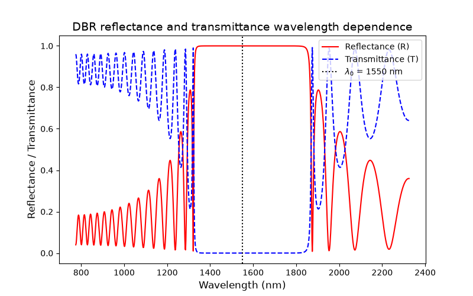
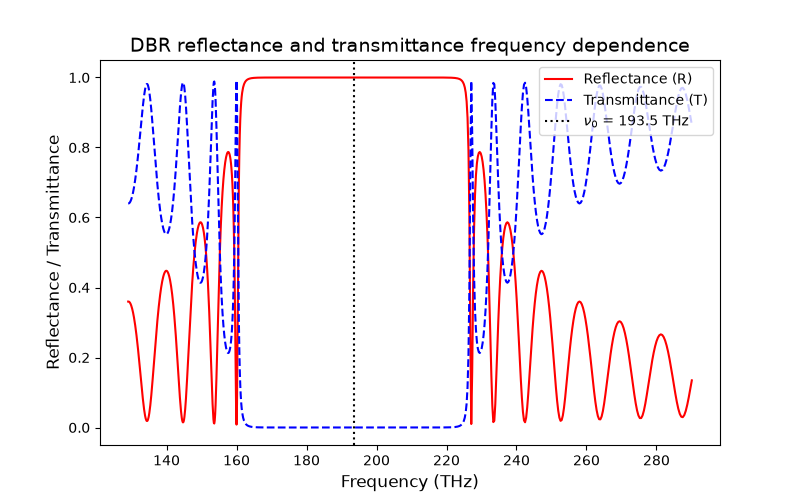
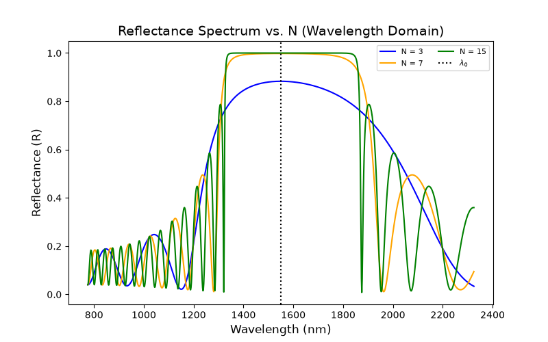
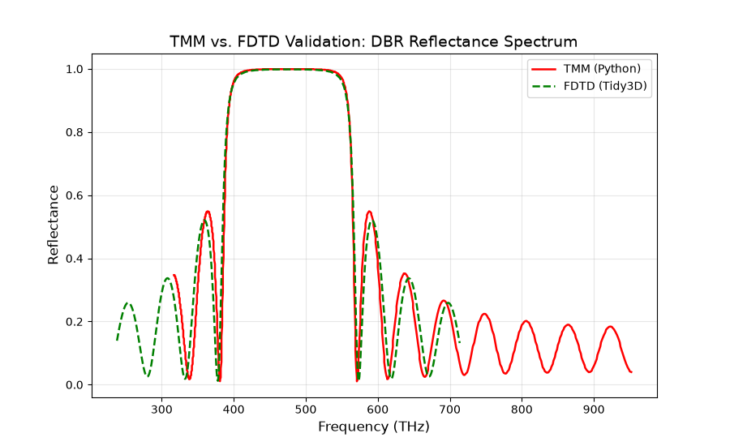

# DBR-TMM: Distributed Bragg Reflector Simulator

Transfer Matrix Method (TMM) simulation of reflectance and transmittance spectra for a DBR stack.
The dependence of reflectance on the number of pairs can be visualized. 
The stopband edges and bandwidth are also calculated.
Simulation has been validated against analogous FDTD simulation in Tidy3D.

## Physics

- Characteristic-matrix formalism for planar layered media
- TE/s and TM/p polarization, oblique incidence via Snell's law
- Closed-form infinite-stack bandwidth cross-check
- Demonstrates frequency-domain stopband symmetry

## Results

### Wavelength-domain spectrum

1550 nm, 15 layers of alternating SiO2 (n = 1.5) and TiO2 (n = 2.5)

### Frequency-domain spectrum (symmetric stopband)

193.5 THz (1550 nm), 15 layers of alternating SiO2 (n = 1.5) and TiO2 (n = 2.5)

### Reflectance vs. number of layer pairs

1550 nm spectra for N pair values of 3, 7, and 15

### Validation against Tidy3D FDTD

630 nm, 8 layers of alternating SiO2 (n = 1.5) and TiO2 (n = 2.5) validated against 1D FDTD in Tidy3D

TMM and FDTD results show strong agreement in stopband center, width, and
peak reflectance, with minor deviations in far side-lobe fringes.

## Usage

```bash
pip install -r requirements.txt
python dbr_tmm.py
```

## Background

Independent photonics simulation project built to model and validate DBR
mirror design, complementing full-wave FDTD simulation with a fast,
first-principles analytic method.
